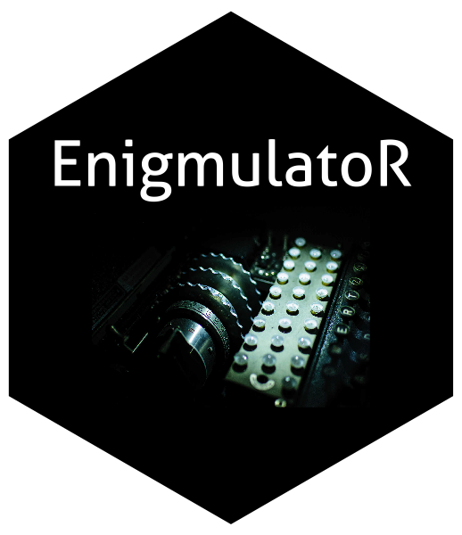

---
output:
  md_document:
  toc: true
toc_depth: 4
---

```{r setup, echo = FALSE}
knitr::opts_chunk$set(echo = TRUE)
```


## EnigmulatoR



`EnigmulatoR` : R package that emulates the Enigma M3 cipher machine used in WWII.

### Installation

```{r eval = FALSE}
devtools::install_github("pjhop/EnigmulatoR")
```

### Usage

Launch the EnigmulatoR shiny app:

```{r eval = FALSE}
library(EnigmulatoR)
EnigmulatoR()
```

The Enigma can also be used in the console, for example:
```{r}
library(EnigmulatoR)
enigma <- Enigma(rotors = c("II", "I", "III"),
                 start_positions = c("D", "E", "F"),
                 ring_settings = c("F", "A", "R"),
                 reflector = "B",
                 plugboard = c(
                   A = "D",
                   C = "Y",
                   F = "Q",
                   G = "R",
                   I = "L",
                   W = "M",
                   Z = "U"
                 )
)

encrypt(enigma, "helloworld")
```

## References

Some sources I used to understand how the machine works:  
- https://www.cryptomuseum.com/crypto/enigma/working.html  
- https://en.wikipedia.org/wiki/Enigma_rotor_details  
- http://users.telenet.be/d.rijmenants/en/enigmatech.html  

Interesting book on Turing and others who cracked the code: "Turing - Jack Copeland" (https://global.oup.com/academic/product/turing-9780198719182?cc=nl&lang=en&)

The hexsticker was created using the `hexSticker` package (https://github.com/GuangchuangYu/hexSticker),
image: https://cdn.comparitech.com/wp-content/uploads/2017/02/enigma-crypto-machine.jpg
